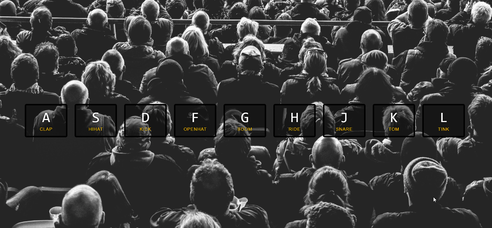
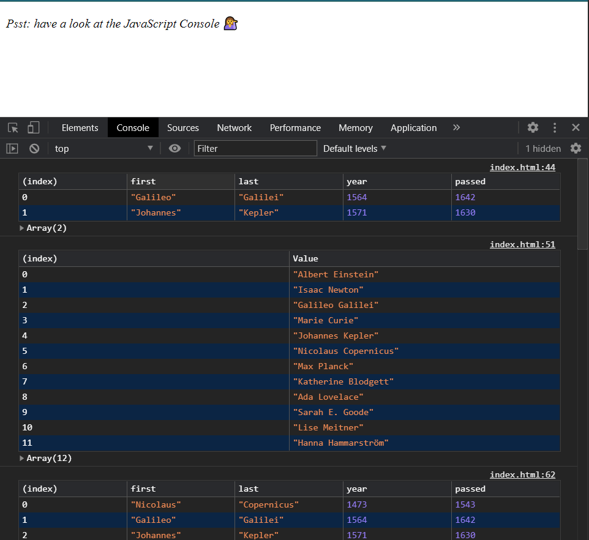
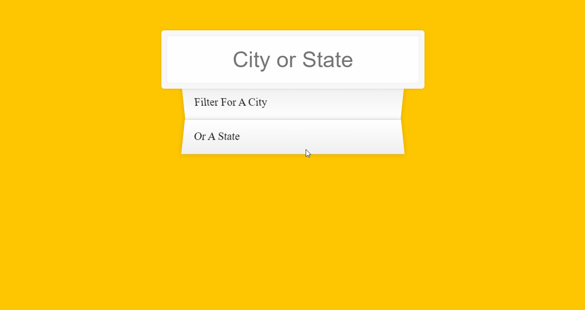

# Welcome To 30-Days of JavaScript.
This challenge is Designed by [Wes Bos](https://github.com/wesbos/JavaScript30.git)

You can grab the Official Tutorial from [here](https://javascript30.com/)

## Day1:
### Drum Kit

## Day2:
### Animated Clock

## Day3:
### CSS-Variables

## Day4:
### Array Methods

## Day5:
### Image Gallery

## Day6:
### Ajax Type Ahead

## Day7:
### Array Methods

## Day8:
### HTML5 Canvas

## Day9:
### Dev Tools

## Day10:
### Checkboxes

## Day11:
### Video Player

## Day 12:
### Key Sequence Detection

